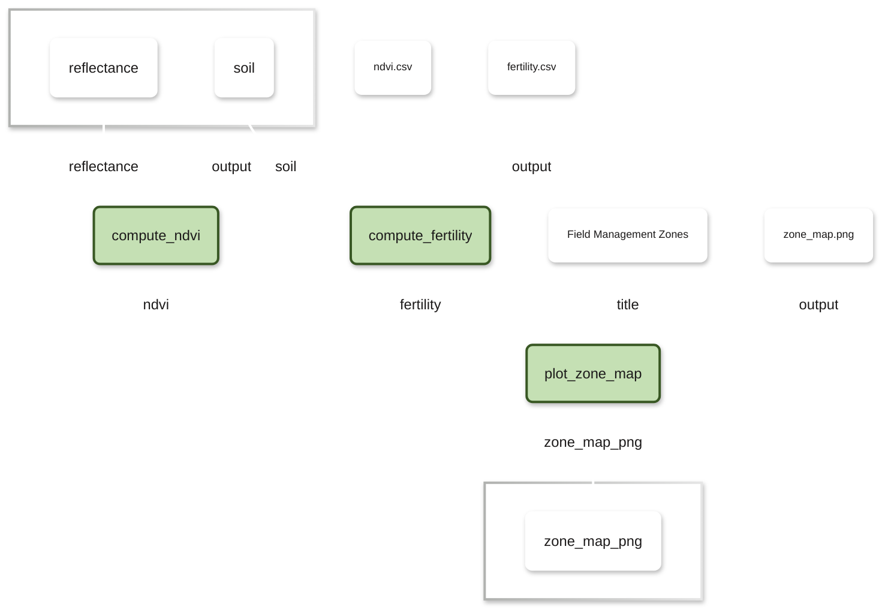
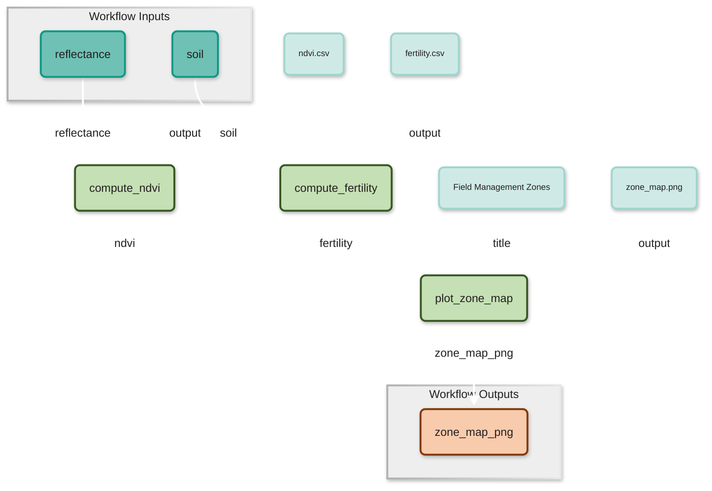
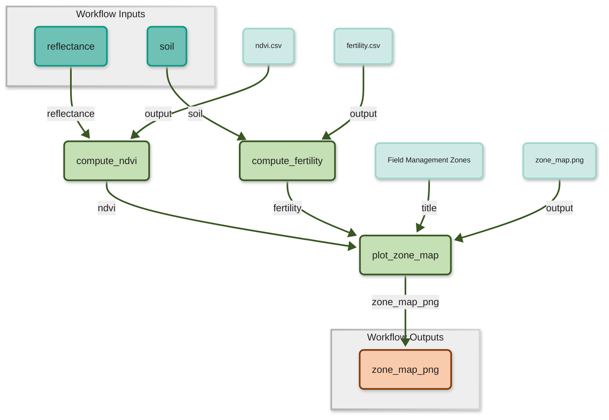

Describes a <b>set of steps</b> that is executed, their <b>inputs and outputs</b>, and the <b>relationships</b> between them

<Box
  label="Why Use a Workflow?"
  :start-click="3"
  :items="[
    { strong: 'Clarity:', text: 'Visualize structure and data flow' },
    { strong: 'Automation:', text: 'Save time on repetitive, recurring tasks' },
    { strong: 'Collaboration:', text: 'Reuse, extend, or swap components built by colleagues' },
    { strong: 'Flexibility:', text: 'Combine Python, R, Bash, etc. in a single pipeline' },
  ]"
/>

 
 
 
 
 <pre>🙋 <b>Has anyone ever used workflow tools?</b></pre> 
 

<!--
notes:
- Start with the definition on screen: "A workflow describes a set of steps
  that is executed." Point to the diagram on the right — at this point it's
  shown in plain grey/white, just the boxes and arrows, no data flow
  highlighted yet. Say: "Think of it as a blueprint — here we have three
  steps: compute_ndvi, compute_fertility, and plot_zone_map."

- [Click 1] The text updates to add "...their inputs and outputs." At the same
  time, the diagram highlights the input nodes (reflectance, soil) in teal and
  the output node (zone_map_png) in orange.
  → Say: "Every workflow step needs something to consume and something to
  produce. Here, reflectance and soil data go in, and a zone map image comes
  out at the end."

- [Click 2] The text adds "...and the relationships between them." The diagram
  now colors in the connecting arrows (green), showing the full data flow.
  → Say: "But a workflow isn't just a list of steps — it's the connections
  between them. Notice how compute_ndvi's output feeds into plot_zone_map,
  and so does compute_fertility's output. This is exactly the kind of
  combination Anna and Ben need — Anna's NDVI step and Ben's fertility step
  feeding into one shared visualization, even though they were written
  separately, possibly in different languages."

- Pause briefly here to let the diagram sink in — this is the "aha" visual
  that ties back to Anna & Ben's story from the motivation slide.

- [Click 3 onward] Transition to the "Why Use a Workflow?" box. The four
  benefits appear one at a time — pace yourself to one per short beat:
  - "Clarity" → visualize structure and data flow (point back at the diagram
    as a live example of this benefit)
  - "Automation" → no more manually re-running scripts in the right order
  - "Collaboration" → reuse or swap out someone else's step, like plugging in
    Ben's R script next to Anna's Python script
  - "Flexibility" → mix Python, R, Bash, etc. in the same pipeline — directly
    solves the "different programming languages" problem from the motivation
    slide

- [Click 8] Deliver the punchline with a bit of humor/timing: "🤯 But there
  are over 300 workflow tools..." Let that land — pause for a laugh or groan.
  → Bridge line: "So the good news is: workflows solve our problem. The bad
  news is now we have a new problem — which one do we pick? That's exactly
  what we'll look at next."

Timing: ~3 min total. The diagram animation is doing a lot of the explaining
visually, so don't over-narrate each color change — just narrate the *meaning*
behind each transition and let it reinforce the definition being built up in
the text on the left.
-->