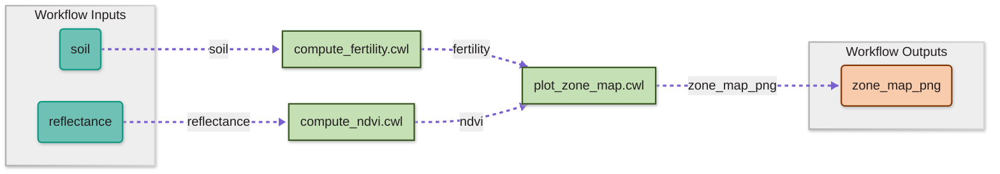

 
 🎨 You'll connect all of these in SciWIn-Studio 
 
 
🙌 Hands-On Session 2 — Create a CWL Workflow with SciWIn-Studio
 
 
1 Create a new workflow with the three steps in <code>SciWIn-Studio</code>
 
2 Connect the steps visually
 
 
 

<!--
notes:
- Bridge from Session 1: "Welcome back. Last session, you built three
  independent CWL tools: compute_ndvi, compute_fertility, and
  plot_zone_map. Each one works on its own, but right now they don't know
  about each other. This session is about wiring them together into one
  actual Workflow."

- Point at the diagram: "Here's the full picture again — three tool boxes,
  green, connected by dashed purple arrows showing data flow. Two inputs
  coming in on the left, one output going out on the right — and every
  single one of these five connections is something you'll draw yourself."

- Point at the legend chip below: "All five arrows — the two inputs, the
  two step-to-step connections, and the final output — get wired up the
  same way: by dragging between ports in SciWIn-Studio's GUI."

- Walk through the "Hands-On Session 2" box: "One task this session —
  open SciWIn-Studio and visually connect all five edges of this workflow:
  reflectance and soil into their steps, the two step outputs into
  plot_zone_map, and plot_zone_map's result out to the final output."

- Bridge: "Let's open SciWIn-Studio and get started."

Timing: ~1-1.5 min. This is an orientation slide — make sure it's clear
that every connection in this session happens visually in Studio, since
that's the structure for the rest of the session.
-->

---
layout: fairagro 
title: "Understanding s4n connect workflow"
disabled: true
---

 
 Every connection follows the same pattern: <code>s4n connect workflow --from &lt;source&gt; --to &lt;target&gt;</code>. There are three types: 
 
 
 
📥 Workflow Input → Step Input
 
 s4n connect workflow  --from reflectance --to compute_ndvi/reflectance 
 
Wires a top-level workflow input into a step's input port.
 
 
 
🔗 Step Output → Step Input
 
 s4n connect workflow  --from compute_ndvi/ndvi_csv --to plot_zone_map/ndvi 
 
Passes one step's output into another step's input — <b>this is what you'll do in SciWIn-Studio</b>.
 
 
 
📤 Step Output → Workflow Output
 
 s4n connect workflow  --from plot_zone_map/zone_map_png --to zone_map_png 
 
Exposes a step's output as a final workflow output.
 
 
 
<!--
notes:
- Introduce the general pattern first: "Every single connection in a CWL
  workflow — no matter what kind — follows the exact same command pattern:
  s4n connect workflow, --from something, --to something. The only thing
  that changes is what's on each side of that arrow."
- Walk through the three card types left to right:
  Card 1 — Workflow Input → Step Input:
  → Say: "This is the simplest case — taking something declared as a
  top-level workflow input, like 'reflectance', and wiring it directly into
  a step's input port. Notice the --to side uses a slash: compute_ndvi
  slash reflectance — that's how you address a specific step's specific
  input."
  Card 2 (highlighted) — Step Output → Step Input:
  → Say: "This is the important one — this is exactly what you'll be doing
  yourselves in Studio in a few minutes. Both sides now have that slash
  notation, because we're connecting one step's output port directly to
  another step's input port. Here, compute_ndvi's ndvi_csv output feeds
  into plot_zone_map's ndvi input."
  → Pause and emphasize: "Even though you'll be doing this by dragging in a
  GUI rather than typing this command, this is precisely what's happening
  behind the scenes."
  Card 3 — Step Output → Workflow Output:
  → Say: "And the mirror image of the first case — taking a step's output
  and exposing it as the final workflow-level output. This is how the
  outside world — or the next person running this workflow — knows where
  to find the final result."
- Wrap-up: "So really, there's only one command and one pattern — --from
  and --to — and it's flexible enough to describe every type of connection
  in the whole workflow."
- Bridge: "Let's see this in action — starting with wiring in Anna's
  reflectance input."
Timing: ~2 min. This is a conceptual anchor slide — take your time here
since understanding this pattern makes the upcoming live demos and the
Studio exercise much easier to follow.
-->

---
layout: fairagro 
title: "SciWIn-Client: connect reflectance"
disabled: true
---

<TerminalDemo :lines="lines3" />

<!--
notes:
- Narrate live as the terminal demo plays (or as you type/run it yourself).

- Before running: "Let's connect our first input — reflectance — into
  compute_ndvi. Following the pattern we just saw: --from reflectance,
  --to compute_ndvi/reflectance."

- As the output appears: "First thing to notice — since this is our first
  connection, s4n actually created a brand new file for us:
  workflows/workflow/workflow.cwl. This is the Workflow file that will tie
  everything together."

- Walk through the diff highlights:
  - "The inputs section, which started empty, now has a proper entry for
    reflectance — File type, with a default location pointing at our data."
  - "The steps section also went from empty to having its first entry:
    compute_ndvi, which takes reflectance as input, points at the
    compute_ndvi.cwl file we built last session, and declares that it
    produces ndvi_csv as output."

- Point out the confirmation line: "And at the bottom, a plain-language
  confirmation: connection added from inputs.reflectance to
  compute_ndvi/reflectance. That's s4n telling us exactly what it just
  did."

- Bridge: "One input down, one to go — let's connect Ben's soil data next."

Timing: ~1.5-2 min. If this is a pre-recorded/scripted terminal demo rather
than something you type live, slow down your narration to match the pace
of the animation rather than rushing ahead of it.
-->

---
layout: fairagro 
title: "SciWIn-Client: connect soil"
disabled: true
---

<TerminalDemo :lines="lines4" />

<!--
notes:
- Same pattern as the previous slide, so you can move a bit faster here.

- Before running: "Same idea, different input — this time we're wiring
  soil into compute_fertility."

- As the diff appears: "Notice the diff view now shows context lines around
  the change — you can see our new soil input slotting in right after the
  reflectance input we just added. And down in steps, a whole new
  compute_fertility entry appears, mirroring the structure of compute_ndvi
  but pointing at soil and the compute_fertility.cwl file."

- Point out the growing structure: "You can literally watch this workflow
  file grow, one connection at a time — that's the point of doing this
  incrementally rather than hand-writing the whole thing at once."

- Bridge: "Two inputs connected. Last CLI step — let's expose the final
  output."

Timing: ~1-1.5 min. This should feel noticeably quicker than the previous
slide since the audience already understands the pattern — lean into the
"see, same thing again" pacing.
-->
---
layout: fairagro 
title: "SciWIn-Client: connect zone_map_png"
disabled: true
---

<TerminalDemo :lines="lines5" />

<!--
notes:
- Frame this as the last CLI step: "Last one on the command line — we're
  connecting the far end of the pipeline: plot_zone_map's output, all the
  way out to the workflow's final output."

- Before running: "Notice the direction here is reversed from the last two
  — --from is now a step's output, plot_zone_map/zone_map_png, and --to is
  a plain workflow-level output, zone_map_png."

- As the diff appears: "The outputs section, which was empty, now declares
  zone_map_png as a File, with outputSource pointing back at
  plot_zone_map/zone_map_png — that's the traceability we talked about
  earlier, you can always see exactly which step produced a given output."

- Point out the new steps entry: "And notice plot_zone_map itself now
  appears in the steps list too — but look closely at its 'in' field: it
  says 'in: []' — empty. That's intentional and important."
  → Pause here deliberately: "This step has no inputs connected yet. That's
  exactly the gap you're going to fill in Studio — plot_zone_map needs
  ndvi and fertility, and right now it has neither."

- Bridge: "So to recap — three CLI commands, two inputs and one output
  wired up. But our workflow is still incomplete, because plot_zone_map
  isn't receiving anything yet. Let's look at a reference slide with these
  commands, then head into Studio to finish the job visually."

Timing: ~2 min. Don't rush past the "in: []" observation — it's the natural
setup for why the Studio exercise is necessary, so let that land clearly.
-->

---
layout: fairagro 
title: "Reference — SciWIn-Client connect commands"
disabled: true
---
 

  
 
 
1️⃣ Connect workflow input → step
 
 
$s4n connect workflow --from reflectance --to compute_ndvi/reflectance
 <button class="copy-btn" :class="{ copied: copiedIndex === 1 }" @click="copyCommand(cmd1, 1)"> {{ copiedIndex === 1 ? '✓ Copied' : '📋 Copy' }} </button> 
 
Wires the <code>reflectance</code> workflow input into <code>compute_ndvi</code>.
 
 
 
2️⃣ Connect workflow input → step
 
 
$s4n connect workflow --from soil --to compute_fertility/soil
 <button class="copy-btn" :class="{ copied: copiedIndex === 2 }" @click="copyCommand(cmd2, 2)"> {{ copiedIndex === 2 ? '✓ Copied' : '📋 Copy' }} </button> 
 
Wires the <code>soil</code> workflow input into <code>compute_fertility</code>.
 
 
 
3️⃣ Connect step → workflow output
 
 
$s4n connect workflow --from plot_zone_map/zone_map_png --to zone_map_png
 <button class="copy-btn" :class="{ copied: copiedIndex === 3 }" @click="copyCommand(cmd3, 3)"> {{ copiedIndex === 3 ? '✓ Copied' : '📋 Copy' }} </button> 
 
Exposes <code>plot_zone_map</code>'s output as the final workflow output.
 
 

<!--
notes:
- Standard reference/lookup slide — keep narration brief.

- Say: "Just like before, here's a reference slide with copy buttons for
  all three commands we just ran — the two input connections and the
  output connection. Feel free to pause here if you want to copy these for
  your own notes."

- Optional: briefly reiterate the pattern one more time for reinforcement:
  "Notice again — first two commands go from a plain name into a
  step/port; the third goes from a step/port into a plain name. Same
  --from/--to structure throughout."

- Bridge: "Now, the part you've been waiting for — let's open SciWIn-Studio
  and finish this workflow by hand."

Timing: ~30-60 sec, or longer if participants are actively copying/running
commands themselves before moving on.
-->

---
layout: fairagro
title: Install SciWIn-Studio
---

Download from the official release page: https://github.com/fairagro/sciwin_studio/releases/tag/v1.0.1 and download:

## Windows

1. Download the `.exe` (or `.msi`) installer from the table above.
2. Run the installer. Windows SmartScreen may show a warning since the app isn't signed. Click **"More info"** (*"Weitere Informationen"*) and then **"Run anyway"** (*"Trotzdem ausführen"*).
3. Follow the installation prompts.

## Linux

**.deb** (Ubuntu/Debian): `sudo dpkg -i SciWIn-Studio_1.0.1_amd64.deb` and `gtk-launch SciWIn-Studio`

## macOS

1. Download the `.dmg` file matching your chip.
2. Open the `.dmg` and drag SciWIn-Studio into Applications.

---
layout: fairagro 
title: Build the Workflow in SciWIn-Studio
---

 

  
 
 
🎯 Your Task
 
 Create a new workflow in <b>SciWIn-Studio</b>, add <code>compute_ndvi</code>, <code>compute_fertility</code> and <code>plot_zone_map</code> as steps, and visually connect <b>all five edges</b> — two workflow inputs, two step-to-step connections, and the final output — by dragging between the matching ports. 
 
 
 
  
 
💡 Hint — How to add steps and draw connections?
 
 Start by clicking on '+' to create a new workflow. Then drag and drop the cwl step files onto the canvas. Create a connection by clicking on the output port of a tool and dragging the line to its matching input port. 
 
 
 
 
 
✅ Show solution
 
 Once fully connected, your workflow graph in SciWIn-Studio should look like this:  
 
 
 
 
 

<!--
notes:
- Transition energy: "Now for the fun part — no typing commands at all,
  we're going to build this whole workflow visually, start to finish."

- Read the task box: "Your job is to open SciWIn-Studio, start a new
  workflow, add compute_ndvi, compute_fertility, and plot_zone_map as
  steps, and then wire up all five connections — the two workflow inputs,
  the two step-to-step edges, and the final output — by dragging between
  ports."

- Point out the download hint box (expanded by default): "If you haven't
  already, grab SciWIn-Studio from the GitHub releases page — it's a
  desktop app, available for Windows, macOS, and Linux. Take a minute now
  if you need to install it."
  → Give people a moment here if installation is needed.

- Point out Hint 2: "Start a new workflow in Studio and add the three .cwl
  tools you built in Session 1 as steps — you should see all three
  represented as boxes, with no connections between them yet."

- Explain exactly what to connect, in order: "First, the two workflow
  inputs — reflectance into compute_ndvi, and soil into compute_fertility.
  Then the two step-to-step edges — compute_ndvi's ndvi_csv output into
  plot_zone_map's ndvi input, and compute_fertility's fertility_csv output
  into plot_zone_map's fertility input. Finally, plot_zone_map's
  zone_map_png output out to the workflow's final output."

- Reassure: "SciWIn-Studio writes the actual workflow.cwl file
  automatically as you drag — so there's no syntax to get wrong here, just
  make sure you're connecting the right ports."

- Give working time: "Take about 10-15 minutes to get this working. If
  you're not sure whether you've done it right, there's a solution image
  under 'Show solution' you can compare against — try not to peek until
  you've given it a real attempt though."

- While people work: circulate and help with port-matching confusion (a
  common mistake is trying to connect an output port to another output
  port, or connecting to the wrong step entirely if multiple ports look
  similar).

- After time is up, reveal the solution image together: "Let's compare —
  open the solution reveal. Your graph should look like this, with
  everything now fully connected from inputs all the way through to the
  final zone_map_png output."

- Close out the session: "And with that, Anna and Ben's workflow is
  complete — a single, reproducible, portable file that runs their entire
  pipeline: two languages, three tools, zero manual copying of files
  between steps."

Timing: ~10-15 min total including setup, working time, and review. This is
the culminating exercise of Session 2 — give it the time it needs, since
successfully completing this is the emotional payoff of the whole workshop
so far.
-->

---
layout: fairagro
title: "SciWIn-Studio: Open a Project" 
---

---
layout: fairagro
title: "SciWIn-Studio: Create a new workflow"
---

---
layout: fairagro
title: "SciWIn-Studio: Add new steps via drag & drop"
---

---
layout: fairagro
title: "SciWIn-Studio: Connect workflow steps"
---

---
layout: fairagro
title: "SciWIn-Studio: Add workflow inputs"
---

---
layout: fairagro
title: "SciWIn-Studio: Save workflow"
disabled: true
---

---
layout: fairagro
title: The complete workflow in SciWIn-Studio
disabled: true
---

  

    
  

<!--
notes:
- Play the clip and narrate along with it: "This is SciWIn-Studio, start to
  finish — creating a new workflow, dragging in the three tools we built
  last session, and wiring up every connection by dragging between ports.
  No command line at all."

- Point at the three feature callouts below:
  - "Visual canvas: every tool shows up as a node on the canvas, connected
    by lines that represent the actual data flowing between them."
  - "Drag to connect: click an output port on one tool, drag to the
    matching input port on another — that's the entire interaction."
  - "Always in sync: you're not editing a diagram that's disconnected from
    reality — every drag you make is written straight into the real
    workflow.cwl file underneath."

- Bridge: "That's exactly what you're about to do yourselves — let's open
  Studio for real."

Timing: ~1 min. Let the clip do the talking — this is a preview to build
confidence before the hands-on exercise, not a deep explanation.
-->
