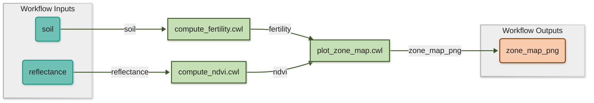

  
 
🙌 Hands-On-Session 3 — Execute the Workflow
 
 
1 Create an <code>inputs.yml</code> with inputs for the entire workflow 
 
2 Execute the workflow locally with SciWIn-Client or SciWIn-Studio
 
 
 

<!--
notes:
- Bridge from Session 2: "Welcome back for the last stretch. Last session,
  you finished connecting the workflow in SciWIn-Studio — all five edges,
  from raw inputs to the final zone map. This session is about actually
  running it."

- Point at the diagram: "Same workflow picture as before, fully connected
  now — three tools, wired together, ready to execute."

- Walk through the "Hands-On Session 3" box:
  - Step 1: "First, we need to give this workflow actual data to run
    against — that means creating an inputs.yml file."
  - Step 2 (highlighted): "Then, we'll actually execute the whole pipeline
    — either with SciWIn-Client on the command line, or from inside
    SciWIn-Studio directly."

- Bridge: "Let's start with generating that inputs file."

Timing: ~1 min. This is a short orientation slide — the payoff of this
session is seeing the workflow actually run end-to-end, so don't linger
here.
-->

---
layout: fairagro
title: "SciWIn-Client: Create inputs.yml file"
---

<TerminalDemo :lines="lines1" />

<!--
notes:
- Before running: "cd into the workflow folder, then one command —
  s4n execute make-template workflow.cwl. This inspects the workflow's
  declared inputs and generates a ready-to-fill template for us."

- As the output appears: "It picked up both top-level inputs we defined —
  reflectance and soil — and pre-filled the file paths pointing at our
  actual data. We didn't have to remember the exact input names or types
  ourselves."

- Point at the final command: "Redirect that output into inputs.yml, and
  we now have a real, runnable inputs file for this workflow."

- Bridge: "With that file in hand, we're ready to actually execute the
  workflow."

Timing: ~1 min. Quick, mechanical step — don't over-explain, the value is
obvious once they see the pre-filled paths.
-->

---
layout: fairagro
title: "SciWIn-Client: Execute locally"
---

<TerminalDemo :lines="lines1" />

<!--
notes:
- Before running: "One command runs the entire pipeline —
  s4n execute --engine local workflow.cwl inputs.yml. That's it. No
  manual steps, no copying files between tools by hand."

- As the log scrolls, narrate the shape of it rather than every line:
  "Watch the step names as they start — compute_ndvi and compute_fertility
  kick off, each building its own Docker image on the fly and running
  inside it. This is the portability payoff: neither of us needed Python
  or R installed locally, SciWIn handled the whole environment."

- Point out the two computed results mid-log: "There's Ben's fertility
  index and Anna's NDVI range, computed exactly like in our live-coding
  demos — except now it's happening automatically, as part of one
  pipeline, in the right order."

- Point at plot_zone_map starting only after both previous steps finish:
  "Notice plot_zone_map doesn't start until both compute_ndvi and
  compute_fertility are done — SciWIn worked out that dependency for us
  from the workflow file, we never told it to wait."

- Point at the final JSON block: "And this is the payoff — a structured,
  traceable record of the final output: zone_map_png, its exact file
  location, and a checksum. That checksum means anyone can verify they got
  byte-for-byte the same result."

- Land the moment: "This is Anna and Ben's original problem, solved —
  two scripts, two languages, zero manual file-copying, running as one
  reproducible pipeline with a single command."

- Bridge: "Let's step back and talk about what made this possible, and how
  to carry these habits into your own work."

Timing: ~2-2.5 min. Let the log scroll and breathe a little — this is the
technical climax of the whole workshop, so let the audience actually watch
it happen rather than narrating over every single line.
-->

---
layout: fairagro
title: "SciWIn-Studio: Select inputs.yml"
---

---
layout: fairagro
title: "SciWIn-Studio: Start workflow execution"
---

---
layout: fairagro
title: "SciWIn-Studio: Run workflow"
---

---
layout: fairagro
title: "Execute a workflow in SciWIn-Studio"
disabled: true
---

  

    
  

